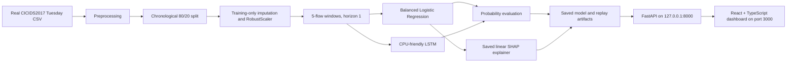
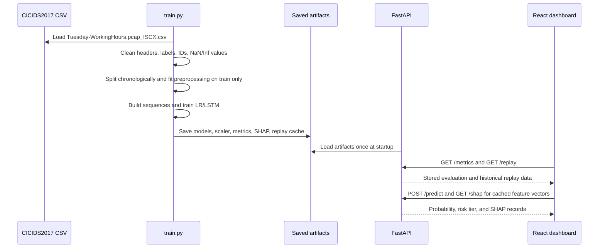

# NetPredict: AI-Based Network Attack Forecasting

> **A cybersecurity prototype for forecasting short-term attack risk from historical CICIDS2017 network-flow behavior.**

[](#project-status)
[](#dataset--cicids2017)
[](#react--typescript-dashboard)
[](#fastapi-backend)

> **Scope notice:** NetPredict replays historical CICIDS2017 data. It does not capture, ingest, or analyze live network traffic. MITRE ATT&CK output is contextual and rule-based, not definitive attribution.

## Table Of Contents

- [Overview](#overview)
- [Problem Statement](#problem-statement)
- [Motivation](#motivation)
- [Objectives](#objectives)
- [Key Features](#key-features)
- [System Architecture](#system-architecture)
- [End-to-End Data Flow](#end-to-end-data-flow)
- [Dataset and Preprocessing](#dataset--cicids2017)
- [Modeling](#modeling)
- [Evaluation and Current Results](#evaluation-and-current-results)
- [Explainability and Security Context](#explainability-and-security-context)
- [Installation and Local Setup](#installation-and-local-setup)
- [Project Structure](#project-structure)
- [Design Decisions](#technical-design-decisions)
- [Limitations and Future Work](#limitations-and-future-work)
- [Project Status](#project-status)
- [Contributors and Disclaimer](#contributors-and-disclaimer)

## Overview

NetPredict is a small, local research system that compares two binary attack-risk models over chronological network-flow data:

1. A class-weighted **Logistic Regression** baseline.
2. A CPU-friendly **Long Short-Term Memory (LSTM)** sequence model.

The pipeline loads the CICIDS2017 Tuesday working-hours CSV, removes identifier columns that could encourage memorization, performs training-only imputation and scaling, creates temporal windows, trains both models, evaluates probability outputs, caches artifacts, and exposes them to a local React dashboard through FastAPI.

The project is designed for academic discussion and hackathon demonstration. It is not a production IDS, IPS, SIEM, threat-intelligence platform, or autonomous response system.

## Problem Statement

Most network-security workflows alert after suspicious traffic has already appeared. This project explores whether chronological flow statistics can provide a short-term probability estimate for the next labeled network-flow window.

The task is deliberately narrow:

- Input: numerical CICIDS2017 flow features in chronological order.
- Target: binary label for the forecasted future flow, where `BENIGN = 0` and every other label is `ATTACK = 1`.
- Output: a probability, a thresholded label, evaluation metrics, and local feature explanations.

The system does not claim to identify an attacker, reconstruct an incident, or prove that a real-world attack is occurring.

## Motivation

The project is motivated by four practical and educational questions:

- Can temporal ordering be preserved in a reproducible ML workflow?
- How does a simple baseline compare with a compact recurrent model on the same holdout?
- How should class imbalance be handled without deleting attack samples?
- How can model outputs be presented with explanations and cautious investigation context?

## Objectives

- Use real CICIDS2017 Tuesday data for the documented evaluation workflow.
- Preserve chronological order during splitting, validation, and training.
- Prevent test-set information from influencing imputation, scaling, or class-weight calculation.
- Compare Logistic Regression and a small LSTM using accuracy, precision, recall, F1, ROC-AUC, and confusion matrices.
- Expose saved artifacts through a simple local API.
- Provide a frontend for historical replay, metrics, probability trends, SHAP contributions, and contextual triage language.
- State current weaknesses plainly, especially the LSTM holdout limitation.

## Key Features

- CICIDS2017 Tuesday working-hours CSV support.
- Identifier removal for `Flow ID`, IP addresses, ports, timestamps, and `Unnamed: 0` when present.
- Training-only median imputation and `RobustScaler` fitting.
- Strict 80/20 chronological train/test split with no dataset shuffle.
- Five-flow lookback and one-flow forecast horizon.
- Logistic Regression with `class_weight="balanced"`.
- LSTM class weights calculated only from the LSTM training partition.
- `shuffle=False` during LSTM training and chronological validation from the latest 10% of training windows.
- Probability-based evaluation at a default classification threshold of `0.5`.
- Exact local SHAP explanations from the saved linear explainer.
- Configurable prototype risk tiers: Low, Medium, High, and Critical.
- FastAPI artifact serving with local Vite CORS.
- React + TypeScript historical replay dashboard.
- No live traffic capture or live packet processing.

## System Architecture



## End-to-End Data Flow



## Dataset: CICIDS2017

The intended dataset is the **CICIDS2017 Tuesday working-hours capture**, commonly distributed as:

```text
Tuesday-WorkingHours.pcap_ISCX.csv
```

Place the real file at:

```text
netpredict/data/raw/Tuesday-WorkingHours.pcap_ISCX.csv
```

The project focuses on the Tuesday traffic containing benign activity and Patator-related attack traffic. The repository currently contains a real CSV in that location, but the file is ignored by Git because of its size and data sensitivity.

### Important Dataset Note

`src/preprocessing.py` contains a development fallback that generates a small synthetic sample when the configured CSV is missing. That fallback exists for code bootstrapping, but it is **not** the source of the documented real-dataset results. For a valid experiment, confirm that the real CICIDS2017 CSV exists before running `train.py`.

The system does not remove attack rows to balance the dataset. The observed class imbalance is retained and handled in model training.

## Dataset Preprocessing

`src.preprocessing.preprocess_traffic()` performs the following operations:

1. Strips whitespace from column names.
2. Finds the label column from the supported label names.
3. Converts the label to binary form.
4. Drops labels and identifier columns.
5. Keeps numeric feature columns.
6. Replaces positive and negative infinity with `NaN`.
7. Removes near-zero-variance columns.

### Binary Label Conversion

The implementation uses:

```python
y = (y_raw != "BENIGN").astype(np.int32)
```

Therefore:

| Raw label condition | Binary label |
|---|---:|
| `BENIGN` | `0` |
| Any other label | `1` (`ATTACK`) |

### Chronological Train/Test Split

`chronological_split()` uses the first 80% of rows for training and the final 20% for testing:

```text
Rows [0 ... 79%]    -> training partition
Rows [80% ... end] -> test partition
```

No random split and no shuffle are used. This keeps future observations out of the training period.

### Data Leakage Prevention

- Identifier columns are removed before modeling.
- Training medians are computed from `X_train` and used for both train and test imputation.
- `RobustScaler` is fitted on `X_train` and only transformed on `X_test`.
- LSTM validation is the latest 10% of the training windows, not the test set.
- LSTM class weights are calculated from `y_lstm_train` only.
- The test partition is used for final evaluation and replay artifact generation, not fitting.
- The SHAP background is created from training baseline windows.

## Time-Window Creation

The configured temporal parameters are defined in `netpredict/src/config.py`:

| Parameter | Value | Meaning |
|---|---:|---|
| `SEQUENCE_LENGTH` | `5` | Five consecutive flow rows are used as sequence context. |
| `FORECAST_HORIZON` | `1` | The target is the next flow row after the lookback. |
| `BATCH_SIZE` | `32` | LSTM training batch size. |
| `EPOCHS` | `15` | Maximum LSTM epochs. |
| `LR_MAX_ITER` | `1000` | Logistic Regression iteration limit. |
| `RANDOM_STATE` | `42` | Logistic Regression random state and SHAP sampling seed. |

The code does not aggregate rows into a documented one-minute bucket. A “window” means a sequence of consecutive flow observations as created by `create_sliding_windows()`.

### Temporal Sequence Construction

For each valid position, `create_sliding_windows()` creates:

- `X_seq`: shape `(number_of_windows, 5, number_of_features)` for the LSTM.
- `y_seq`: the binary label at the one-step-ahead target position.
- `X_baseline`: the most recent flow vector in each sequence for Logistic Regression.

The currently generated local artifact contains:

```text
X_seq:  (200, 5, 67)
X_base: (200, 67)
```

The replay cache is capped at 200 consecutive test windows.

## Modeling

### Logistic Regression Baseline

The baseline uses scikit-learn `LogisticRegression` with:

- `class_weight="balanced"`
- `solver="lbfgs"`
- `max_iter=1000`
- `random_state=42`

It consumes `X_train_base`, the latest scaled flow vector from each training sequence. It produces an attack probability with `predict_proba()`.

### LSTM Temporal Model

The LSTM is intentionally small for CPU-friendly local training:

```text
LSTM(32, return_sequences=False)
Dropout(0.2)
Dense(16, activation="relu")
Dense(1, activation="sigmoid")
```

Training uses Adam with learning rate `0.001`, binary cross-entropy, accuracy as a training metric, early stopping on chronological validation loss, and `restore_best_weights=True`.

The class weights are computed with scikit-learn’s balanced formula from the LSTM training labels only, then passed to Keras `model.fit(class_weight=...)`. The LSTM uses `shuffle=False`.

### Model Training Methodology

The training sequence in `train.py` is:

1. Load the real raw CSV.
2. Preprocess features and labels.
3. Split chronologically.
4. Impute and scale using training statistics.
5. Create training and test windows.
6. Split only the training windows chronologically for LSTM training and validation.
7. Train Logistic Regression on training baseline vectors.
8. Train the LSTM on training sequence windows with training-only class weights.
9. Predict probabilities on the untouched test windows.
10. Calculate metrics and confusion matrices.
11. Build the saved SHAP explainer from training baseline data.
12. Save models, metrics, feature names, and a 200-window replay cache.

## Evaluation Methodology

Both models are evaluated on the final chronological test holdout. The evaluation function converts probabilities to predicted labels at a threshold of `0.5` and retains the original probability values for ROC-AUC.

Reported metrics:

- Accuracy
- Precision
- Recall
- F1 score
- ROC-AUC
- Confusion matrix in `[[TN, FP], [FN, TP]]` order

The frontend displays the values loaded from `netpredict/models/model_metrics.json`; it does not replace them with demo constants.

## Actual Evaluation Metrics

These are the actual values currently stored in `netpredict/models/model_metrics.json`.

| Model | Accuracy | Precision | Recall | F1 | ROC-AUC |
|---|---:|---:|---:|---:|---:|
| Logistic Regression (Baseline) | 86.81% | 1.63% | 11.10% | 2.84% | 0.5046 |
| LSTM Temporal Model | 98.26% | 0.00% | 0.00% | 0.00% | 0.4957 |

### Confusion Matrices

| Model | TN | FP | FN | TP |
|---|---:|---:|---:|---:|
| Logistic Regression (Baseline) | 77,244 | 10,383 | 1,378 | 172 |
| LSTM Temporal Model | 87,627 | 0 | 1,550 | 0 |

### Interpretation Of Current Results

The current LSTM test result must be interpreted cautiously:

- Accuracy is **98.26%**.
- Precision, recall, and F1 are **0%**.
- The confusion matrix shows that the LSTM predicted every test sample as `BENIGN` at the `0.5` threshold.
- ROC-AUC is **0.4957**, which is close to chance for this stored holdout.

The high accuracy is therefore largely explained by the benign majority class. It does not demonstrate that the LSTM detects attacks effectively, and this README does not claim that the LSTM outperforms the Logistic Regression baseline.

The Logistic Regression baseline identifies some attack cases but has low precision, recall, and F1 on this chronological holdout. These results are a central limitation of the current experiment, not a reason to hide or alter the metrics.

## Explainability With SHAP

`src/explainability.py` defines `TrafficExplainer`, which uses `shap.LinearExplainer` for the saved Logistic Regression model. The explainer is built from training baseline data and cached as:

```text
netpredict/models/shap_explainer.joblib
```

For a supplied feature vector, the API:

1. Validates the feature count.
2. Applies the saved scaler.
3. Passes the scaled vector to the existing serialized explainer.
4. Returns the top five feature contributions by absolute SHAP impact.

Each returned record includes the feature name, scaled value, SHAP value, direction, and contribution intensity. Positive SHAP values push the model output toward attack risk; negative values push it toward the benign reference.

SHAP is an explanation of the Logistic Regression output. It is not proof of causation, attacker intent, or attribution.

## Risk Scoring And Configurable Thresholds

`netpredict/src/config.py` defines the prototype probability bands:

| Risk level | Probability range |
|---|---:|
| `LOW` | `0.00` to `< 0.25` |
| `MEDIUM` | `0.25` to `< 0.50` |
| `HIGH` | `0.50` to `< 0.75` |
| `CRITICAL` | `0.75` to `1.00` |

The API uses these thresholds for `/predict` risk labels. The React dashboard also presents configurable display cutoffs initialized to 25%, 50%, and 75% for its prototype decision-support view. These thresholds are not official cybersecurity standards.

`predicted_label` from `/predict` uses a separate binary probability threshold of `0.5`:

- `probability >= 0.5` -> `ATTACK`
- `probability < 0.5` -> `BENIGN`

## MITRE ATT&CK Contextual Mapping

`src/mitre_mapping.py` contains a small knowledge base with contextual references such as:

- `T1046` — Network Service Discovery
- `T1110.001` — Brute Force: Password Guessing
- `T1498` — Network Denial of Service
- `T1071` — Application Layer Protocol

The mapping compares top contributing feature names and risk context with predefined traffic indicators. It is a defensive, rule-based investigation aid. It does not prove that a technique occurred, identify an actor, establish reconnaissance, or provide MITRE ATT&CK attribution.

## FastAPI Backend

The backend is implemented in `netpredict/api.py`. It uses absolute paths derived from the API file location and loads artifacts once during application startup through the FastAPI lifespan hook.

Backend base URL for local development:

```text
http://127.0.0.1:8000
```

Allowed local frontend origins are:

- `http://localhost:3000`
- `http://127.0.0.1:3000`

### API Endpoints

#### `GET /health`

Returns a simple service check:

```bash
curl http://127.0.0.1:8000/health
```

```json
{"status":"ok"}
```

#### `GET /metrics`

Returns the stored contents of `models/model_metrics.json`.

```bash
curl http://127.0.0.1:8000/metrics
```

The response contains the two model names, five metrics, and each confusion matrix. Metrics are not hardcoded in the API.

#### `GET /replay`

Returns up to 200 historical test windows from `data/processed/test_replay_windows.npz`:

```bash
curl http://127.0.0.1:8000/replay
```

Response shape:

```json
{
  "y_true": [0, 0, 1],
  "lr_probs": [0.42, 0.30, 0.58],
  "lstm_probs": [0.01, 0.01, 0.02],
  "features": [[0.1, -0.2, 0.3]]
}
```

The example values are illustrative response shape only; the API returns the saved real arrays. This endpoint represents historical CICIDS2017 replay, not live traffic.

#### `POST /predict`

Accepts raw feature values in the exact trained feature order. The current trained artifact contains 67 features.

```bash
FEATURES=$(.venv/bin/python -c 'import json,numpy as np; print(json.dumps(np.load("data/processed/test_replay_windows.npz")["X_base"][0].tolist()))')
curl -X POST http://127.0.0.1:8000/predict \
  -H "Content-Type: application/json" \
  --data "{\"features\":$FEATURES}"
```

Response shape:

```json
{
  "probability": 0.21,
  "predicted_label": "BENIGN",
  "risk_level": "LOW"
}
```

The shown values are response shape only. Real values are calculated by the saved scaler and Logistic Regression model.

#### `GET /shap`

Accepts repeated `features` query parameters in trained feature order and uses the saved SHAP artifact:

```bash
QUERY=$(.venv/bin/python -c 'import numpy as np; from urllib.parse import urlencode; values=np.load("data/processed/test_replay_windows.npz")["X_base"][0].tolist(); print(urlencode([("features", value) for value in values]))')
curl -G http://127.0.0.1:8000/shap --data "$QUERY"
```

Response shape:

```json
{
  "explanations": [
    {
      "Feature": "Feature name",
      "Contribution": "High",
      "Direction": "Lowers Risk",
      "SHAP_Value": -0.12,
      "Value": 0.34
    }
  ],
  "methodology_note": "..."
}
```

The returned feature records and values are generated from the saved explainer. The displayed example is not a model result.

## React + TypeScript Dashboard

The frontend is the Vite application at the repository root. The main screen is implemented in `src/App.tsx` and retains the existing single Forecast Dashboard view.

The dashboard:

- Fetches metrics from `/metrics`.
- Fetches historical labels, probabilities, and `X_base` vectors from `/replay`.
- Calls `/predict` for each selected cached feature vector.
- Calls `/shap` for actual Logistic Regression explanations.
- Displays a chronological probability trend.
- Shows confusion matrices and stored metrics.
- Provides replay controls and prototype risk cutoffs.
- Keeps the historical-replay and non-live-traffic disclaimer visible.
- Displays loading and API error states.

The frontend does not create model metrics, predictions, or SHAP values locally.

### Historical Replay Workflow

1. Start the FastAPI backend.
2. Start the Vite frontend.
3. The dashboard requests `/metrics` and `/replay`.
4. A replay index selects one cached `X_base` vector and its stored probabilities.
5. The frontend sends that vector to `/predict` and `/shap`.
6. The dashboard renders the returned Logistic Regression probability and SHAP records alongside the stored LSTM replay probability.
7. Playback advances through the cached chronological test windows.

This is a replay of saved test data. It is not a stream from a network interface.

## Project Folder Structure

```text
ai-network-attack-forecasting/
├── index.html
├── package.json                    # Root Vite/React scripts and dependencies
├── package-lock.json
├── tsconfig.json
├── vite.config.ts
├── src/
│   ├── App.tsx                     # React dashboard and API integration
│   ├── codeFiles.ts                # Code viewer content used by the UI
│   ├── index.css                   # Frontend styling
│   ├── main.tsx                    # React entry point
│   └── sampleData.ts               # Legacy sample definitions; live dashboard data comes from API
└── netpredict/
    ├── api.py                      # FastAPI backend
    ├── train.py                    # End-to-end training and artifact export
    ├── requirements.txt            # Python dependencies
    ├── app/
    │   └── streamlit_app.py        # Existing Streamlit dashboard
    ├── data/
    │   ├── raw/
    │   │   └── Tuesday-WorkingHours.pcap_ISCX.csv
    │   └── processed/
    │       └── test_replay_windows.npz
    ├── models/
    │   ├── feature_names.joblib
    │   ├── logistic_regression.joblib
    │   ├── lstm_model.h5
    │   ├── model_metrics.json
    │   ├── scaler.joblib
    │   └── shap_explainer.joblib
    └── src/
        ├── config.py               # Paths, hyperparameters, thresholds
        ├── explainability.py       # SHAP explainer construction and formatting
        ├── mitre_mapping.py        # Contextual rule-based mappings
        ├── models.py               # LR, LSTM, training, evaluation, persistence
        └── preprocessing.py        # Cleaning, split, scaling, windows
```

`netpredict/models/` and `netpredict/data/processed/` contain generated artifacts. Several large artifact types are ignored by Git; a local checkout may need training to recreate them.

## Installation Requirements

### Python

- Python 3.9, 3.10, or 3.11 is the documented compatibility range.
- A virtual environment is recommended.
- The Python dependencies are listed in `netpredict/requirements.txt`.
- TensorFlow, scikit-learn, SHAP, pandas, NumPy, joblib, FastAPI, and Uvicorn are required for the Python side.

### Frontend

- Node.js and npm.
- Root dependencies from `package.json`.
- React 19, TypeScript, Vite, Tailwind Vite integration, and Lucide icons are used by the current frontend.

### Data and artifacts

- Real `Tuesday-WorkingHours.pcap_ISCX.csv` at `netpredict/data/raw/`.
- The training command generates or refreshes the model and replay artifacts.
- The API requires the generated artifacts to exist before startup.

## Complete Local Setup

From the repository root:

```bash
cd ai-network-attack-forecasting
```

Create the Python environment:

```bash
cd netpredict
python3 -m venv .venv
source .venv/bin/activate
pip install -r requirements.txt
```

Place the real dataset at:

```text
netpredict/data/raw/Tuesday-WorkingHours.pcap_ISCX.csv
```

Before training, verify that the file exists:

```bash
test -f data/raw/Tuesday-WorkingHours.pcap_ISCX.csv && echo "Real CICIDS2017 CSV found"
```

## How To Run The Training Pipeline

Training is manual and can take time on a laptop. From `netpredict/` with the virtual environment active:

```bash
python train.py
```

This command trains models and writes:

- `models/logistic_regression.joblib`
- `models/lstm_model.h5`
- `models/scaler.joblib`
- `models/feature_names.joblib`
- `models/shap_explainer.joblib`
- `models/model_metrics.json`
- `data/processed/test_replay_windows.npz`

Do not run this command merely to start the API or frontend. It retrains and overwrites generated artifacts.

## How To Run The Backend

From `netpredict/`:

```bash
source .venv/bin/activate
.venv/bin/uvicorn api:app --reload --port 8000
```

Or, with the virtual environment activated:

```bash
uvicorn api:app --reload --port 8000
```

Verify the service:

```bash
curl http://127.0.0.1:8000/health
```

Expected response:

```json
{"status":"ok"}
```

The API loads model artifacts once at startup. If required files are missing, startup fails with a missing-artifact error rather than fabricating outputs.

## How To Run The Frontend

From the repository root, in a second terminal:

```bash
npm install
npm run dev
```

Open:

```text
http://localhost:3000
```

The frontend expects the API at `http://127.0.0.1:8000`. Start the backend first so the dashboard can load metrics and replay data.

For a production build:

```bash
npm run build
```

For TypeScript checking:

```bash
npm run lint
```

The existing Streamlit dashboard can still be launched from `netpredict/` with:

```bash
streamlit run app/streamlit_app.py
```

That is a separate existing interface from the React + FastAPI workflow.

## Technical Design Decisions

| Decision | Reason |
|---|---|
| Chronological split | Prevents future observations from entering training and better reflects temporal forecasting. |
| No dataset shuffle | Preserves temporal order for sequences and evaluation. |
| Identifier removal | Reduces trivial memorization of IPs, ports, flow IDs, and timestamps. |
| Training-only imputation | Prevents test-distribution statistics from influencing preprocessing. |
| Training-only scaling | Ensures the scaler represents only the training period. |
| RobustScaler | More resistant to heavy-tailed flow measurements and extreme values than a simple min-max transform. |
| Balanced Logistic Regression | Gives the minority class more training influence without deleting observations. |
| LSTM class weights | Addresses the benign/attack imbalance using only the LSTM training partition. |
| Small LSTM | Keeps the experiment practical on CPU hardware. |
| Probability-based evaluation | Preserves ranking information for ROC-AUC instead of evaluating only hard labels. |
| Linear SHAP | Provides fast exact local explanations for the Logistic Regression model. |
| Saved artifacts | Makes the API and dashboard repeatable without retraining per request. |
| Local FastAPI + Vite | Keeps the hackathon workflow simple and easy to inspect. |

## Current Results

The current generated artifact is useful as an honest baseline, not as evidence of production readiness:

- The baseline has `86.81%` accuracy but low precision (`1.63%`), recall (`11.10%`), and F1 (`2.84%`).
- The LSTM has `98.26%` accuracy but predicts no positive test samples at the default threshold, producing `0%` precision, recall, and F1.
- The LSTM ROC-AUC is `0.4957`, near chance on this holdout.
- The class imbalance and chronological ordering make accuracy alone misleading.

No claim is made that one model wins. The artifacts document the current behavior and provide a basis for further experimentation.

## Limitations

- The current LSTM does not detect positive cases on the stored chronological test holdout at threshold `0.5`.
- The Logistic Regression baseline has very low precision and F1.
- Results depend on one CICIDS2017 Tuesday capture and one chronological split.
- The dataset is a benchmark, not a representative live enterprise telemetry stream.
- The system uses flow features, not packet payload inspection.
- There is no live capture, stream processor, alert queue, authentication-log correlation, or automated response.
- The API is a local prototype without authentication, rate limiting, TLS termination, or production observability.
- The frontend uses fixed localhost API configuration.
- Risk tiers are prototype thresholds and are not calibrated cybersecurity standards.
- SHAP explains the Logistic Regression artifact, not the LSTM’s temporal representation.
- The current replay cache contains at most 200 test windows for interaction convenience.
- The fallback synthetic-data function exists in code but must not be used for claims about the real CICIDS2017 results.

## Security And Ethical Considerations

- Treat all model output as decision support requiring human review.
- Do not use risk tiers as proof of compromise or as an automatic basis for blocking traffic.
- Do not treat contextual MITRE references as attribution.
- Protect raw traffic data and generated artifacts because network-flow records may contain sensitive operational information.
- Review the dataset’s license and provenance before redistribution.
- Validate models against representative, current, and organization-specific data before any operational use.
- Monitor false positives and false negatives, especially when the benign class dominates.
- Keep API access local unless authentication, authorization, transport security, and input controls are added.

## Future Improvements

Possible research and engineering extensions include:

- Calibrate probability outputs and choose operating thresholds using a validation protocol appropriate for the security objective.
- Add precision-recall curves, PR-AUC, balanced accuracy, and class-specific error analysis.
- Investigate why the class-weighted LSTM still produces no positive predictions on the current holdout.
- Evaluate multiple chronological folds, additional CICIDS2017 days, and independent datasets.
- Tune sequence length and forecast horizon without using the test set.
- Compare against tree-based and other time-series baselines.
- Add model versioning, artifact checksums, and reproducible experiment metadata.
- Add API authentication and production-grade observability before network exposure.
- Replace the local replay source with a controlled streaming adapter only after a separate live-data design and validation effort.
- Improve the frontend’s use of API-provided risk metadata while retaining explicit uncertainty and non-attribution language.
- Add automated tests for preprocessing, API schemas, artifact loading, and frontend API error states.

## Running Locally with Docker

The project is containerized using Docker and Docker Compose. The Docker setup runs the React frontend, Nginx reverse proxy, and FastAPI backend as separate services.

### Prerequisites

Install the following before running the project:

- Git
- Docker Desktop

Docker Desktop includes Docker Compose.

### 1. Clone the repository

```bash
git clone <YOUR-GITHUB-REPOSITORY-URL>
cd ai-network-attack-forecasting
````

### 2. Build and start the application

Run:

```bash
docker compose up --build
```

This command builds the frontend and backend Docker images and starts the application.

The project consists of the following services:

* **Frontend:** React + TypeScript application
* **Nginx:** Serves the frontend and acts as a reverse proxy for the backend API
* **Backend:** FastAPI application
* **ML components:** Model artifacts and supporting application data

### 3. Open the dashboard

Once the containers are running, open the following address in your browser:

```text
http://localhost:3000
```

The Network Attack Forecasting dashboard should be available there.

### 4. Check the backend health

The FastAPI backend is accessed through the Nginx reverse proxy using the `/api` path.

To verify that the backend is running, open:

```text
http://localhost:3000/api/health
```

A successful response indicates that the backend is running correctly.

### 5. Stop the application

To stop the running containers, press:

```text
Ctrl + C
```

in the terminal running Docker Compose.

Alternatively, you can stop and remove the containers with:

```bash
docker compose down
```

### Notes

Large raw datasets are intentionally not included in the GitHub repository. They are excluded through `.gitignore` because of their file size.

If a dataset is required to reproduce the training pipeline, obtain the required dataset separately and place it in the expected data directory.

The Docker configuration is intended for local development, demonstration, and evaluation. It is not a production deployment configuration.

## Project Status

**Status: Functional academic/hackathon prototype.**

Implemented:

- Real CICIDS2017 preprocessing and chronological training pipeline.
- Class-weighted Logistic Regression and LSTM training paths.
- Saved model, scaler, metrics, SHAP, and replay artifacts.
- FastAPI backend with health, metrics, replay, prediction, and SHAP endpoints.
- React + TypeScript dashboard connected to the local API.
- Production frontend build verified with `npm run build`.

Not implemented:

- Live network traffic ingestion.
- Production deployment and authentication.
- Proven attack attribution.
- A validated operational detection or response capability.

### Suggested Screenshot Placeholder

`[Add Dashboard Screenshot Here]`

Recommended screenshots would show the historical replay dashboard, the model comparison table, the SHAP contribution panel, and the API-backed loading state. Screenshots should be labeled as historical replay rather than live monitoring.

## Team And Contributors

This repository does not currently contain a contributor roster. Add project-specific names, affiliations, roles, and links here:

```text
- [Contributor Name] — [Role / Institution] — [Profile or contact link]
- [Contributor Name] — [Role / Institution] — [Profile or contact link]
```

## Disclaimer

NetPredict is a hackathon research prototype for educational and defensive analysis. It replays historical CICIDS2017 data and does not process live network traffic. Its probabilities, risk thresholds, SHAP explanations, and MITRE ATT&CK references are experimental decision-support outputs. They are not official cybersecurity standards, incident determinations, legal conclusions, or definitive attribution. Do not deploy the system in a production environment without independent validation, security review, access controls, monitoring, and human oversight.
